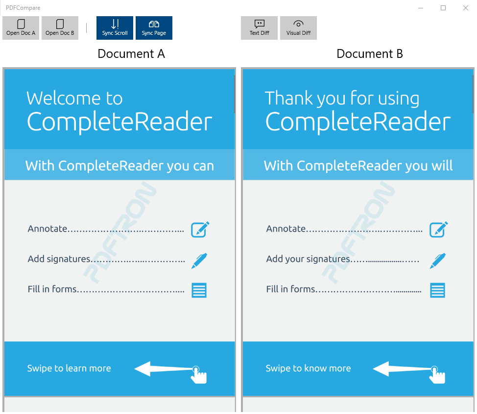
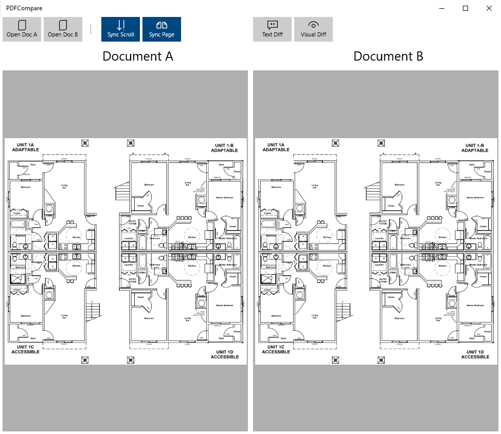
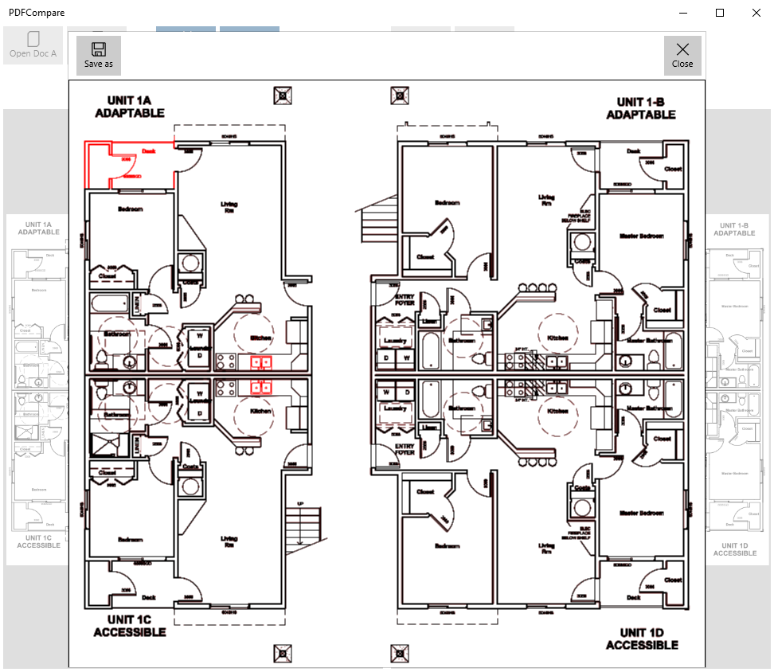

# PDFCompare Sample

This sample demonstrate how to use PDFTron's Text Difference and Visual Difference features by
comparing two PDF documents and getting an result PDF document as result.

Platforms: x86, x64, ARM32 and ARM64

## Text Diff Sample

Compare the text of two PDF documents and display the result on a dialog




Visual Diff Sample

Compare the visual differences of two blueprints (PDF documents) and display the result on a dialog

Note: Please load the sample documents diff_doc_1 and diff_doc_2 to run the Visual Diff sample.





## Project structure
```
PDFCompare/
	art/								- Project images
	PDFCompare/
		Assets/							- App resources
		Controls/						- Helper controls
		Properties/	
		Resources/						
		ViewModel/						- MVVM files
		App.xaml
		App.xaml.cs
		MainPage.xaml					- Main app page
		MainPage.xaml.cs
		PDFCompare.csproj
		Package.appxmanifest
	PDFCompare.sln
```

## Running the Sample

To run the sample, open the solution in Visual Studio 2019 and restore all the Nuget packages

## License

See [license](./../LICENSE).
