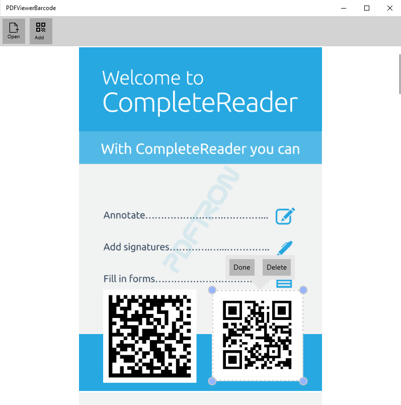

# PDFViewer Sample

This sample demonstrate how to generate and stamp barcodes and QR codes into a PDF.
It uses an open-source [ZXing](https://github.com/micjahn/ZXing.Net/) for QR Code/barcode generation.

Platforms: x86, x64, ARM32 and ARM64



## Project structure
```
PDFViewerBarcode/
	PDFViewerBarcode/
		Assets/							- App resources
		Control/						- Helper controls
		Properties/	
		Resources/						
		ViewModel/						- MVVM files
		App.xaml
		App.xaml.cs
		MainPage.xaml					- Main app page
		MainPage.xaml.cs
		PDFViewerBarcode.csproj
		Package.appxmanifest
	PDFViewerBarcode.sln
```

## Running the Sample

To run the sample, open the solution in Visual Studio 2019 and restore all the Nuget packages

## License

See [license](./../LICENSE).
