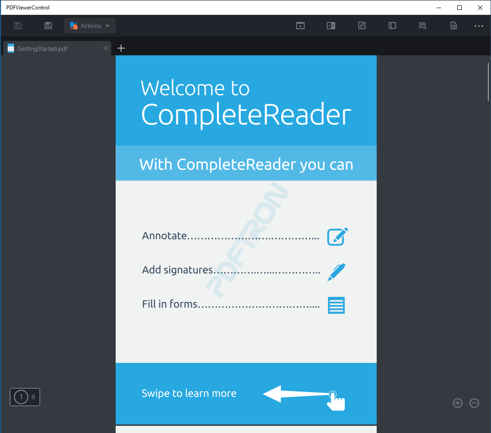

# PDFViewer Sample

This sample demonstrate how to implement the ViewerControl on a UWP application

### Features
- Convert differernt formats to PDF : .doc, .docx, .ppt, .pptx, .xls, .xlsx, .oxps, .xps, .jpeg, .jpg, .png, .bmp, .cbz
- Open multiples PDFs
- Edit, Re-order, Duplicate, Delete and Export PDF pages
- Multiple color modes (Dark, Sepia, Light, Custom colors)
- Reduce PDF File size
- Search text
- Reflow Mode (Read mode)
- Encrypt PDF by adding password
- Print PDF file
- Share PDF file
- Annotation Toolbar with multiples tools

Platforms: x86, x64, ARM32 and ARM64

Guide: https://www.pdftron.com/documentation/uwp/guides/using-viewercontrol/



## Project structure
```
PDFViewerControl/
	PDFViewerControl/
		Assets/							- App resources
		Properties/	
		Resources/						
		ViewModel/						- MVVM files
		App.xaml
		App.xaml.cs
		MainPage.xaml					- Main app page
		MainPage.xaml.cs
		PDFViewerControl.csproj
		Package.appxmanifest
	PDFViewerControl.sln
```

## Running the Sample

To run the sample, open the solution in Visual Studio 2019 and restore all the Nuget packages

## License

See [license](./../LICENSE).
