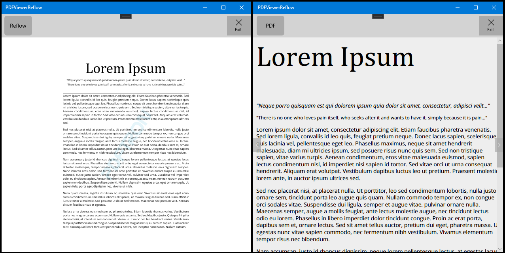

# PDFViewer ReflowView Sample

This sample demonstrates how to implement the ReflowView on a UWP application

## ReflowView Sample
Headings and columns (left) reflow in a logical reading order (right).



Platforms: x86, x64, ARM32 and ARM64

Guide: https://www.pdftron.com/documentation/uwp/guides/basics/reflow

## Project structure
```
PDFViewerReflow/
	PDFViewerReflow/
		Assets/							- App resources
		Properties/	
		Resources/						
		ViewModel/						- MVVM files
		App.xaml
		App.xaml.cs
		MainPage.xaml					- Main app page
		MainPage.xaml.cs
		PDFViewerReflow.csproj
		Package.appxmanifest
	PDFViewerReflow.sln
```

## Running the Sample

To run the sample, open the solution in Visual Studio 2019 and restore all the Nuget packages

## License

See [license](./../LICENSE).