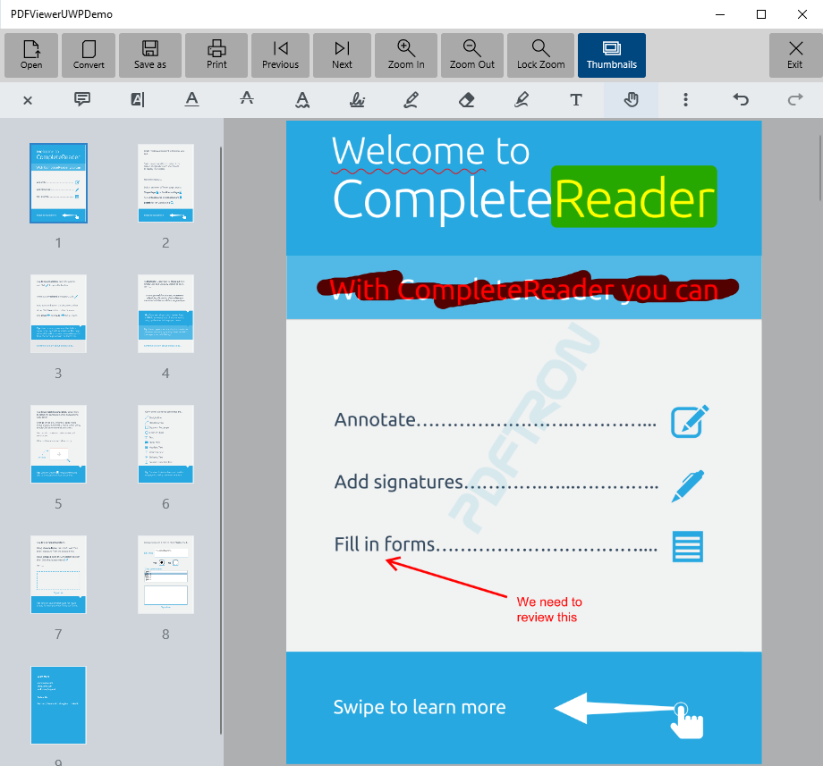

# PDFViewer Sample

This sample demonstrate how to implement the PDFViewer on a UWP app using MVVM pattern.
It can target x86, x64, ARM32 and ARM64



## Project structure
```
PDFViewerUWPDemo/
	PDFViewerUWPDemo/
		Assets/							- App resources
		Properties/						
		ViewModel/						- MVVM files
		App.xaml
		App.xaml.cs
		MainPage.xaml					- Main app page
		MainPage.xaml.cs
		PDFViewerUWPDemo.csproj
		Package.appxmanifest
	PDFViewerUWPDemo.sln
```

## Running the Sample

To run the sample, open the solution in Visual Studio 2019 and restore all the Nuget packages

## License

See [license](./../LICENSE).