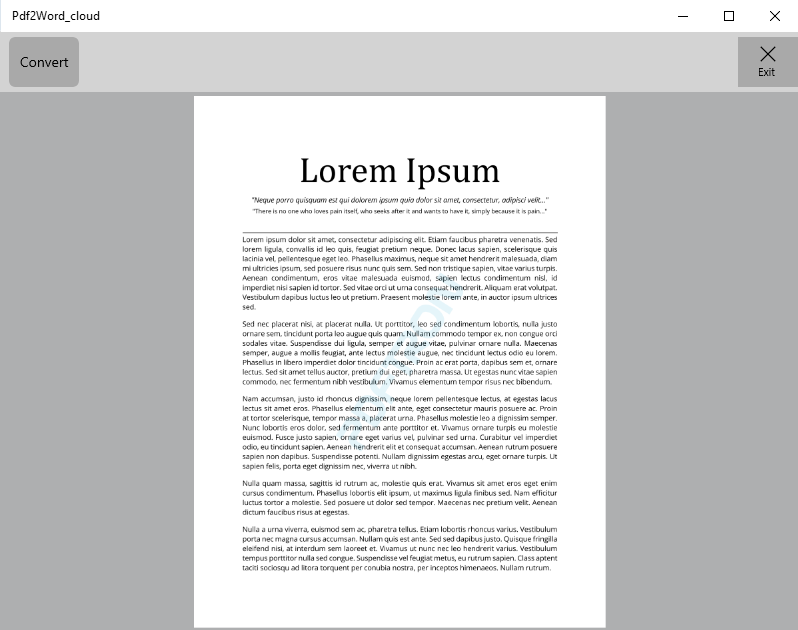

# PDF to Word Sample

This sample demonstrate how to convert a PDF to Word (.docx) using our EasyPDF Cloud service.

Platforms: x86, x64, ARM32 and ARM64



## Project structure
```
Pdf2Word_cloud/
	Pdf2Word_cloud/
		Assets/							- App resources
		Properties/				
		ViewModel/						- MVVM files
		App.xaml
		App.xaml.cs
		MainPage.xaml					- Main app page
		MainPage.xaml.cs
		Pdf2Word_cloud.csproj
		Package.appxmanifest
	Pdf2Word_cloud.sln
```

## Running the Sample

To run the sample, open the solution in Visual Studio 2019 and restore all the Nuget packages

## License

See [license](./../LICENSE).
